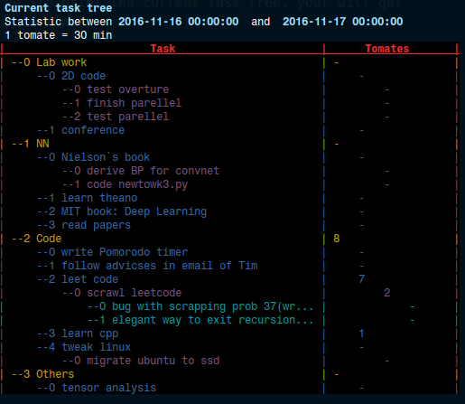
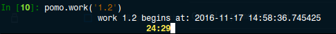

<!-- MarkdownTOC -->

- [Description](#description)
- [Requirement](#requirement)
- [Usage](#usage)
    - [Creat your task tree](#creat-your-task-tree)
    - [Lauch Pomotask](#lauch-pomotask)
    - [Start a work event](#start-a-work-event)
    - [Print statistics](#print-statistics)
    - [Micellaneous](#micellaneous)
- [TODOS](#todos)

<!-- /MarkdownTOC -->

<a name="description"></a>
## Description
**Pomotask** is a Pomodoro timer with statistics on your tasktree. It helps improving your work efficiency by using the [Pomodoro Technique](https://en.wikipedia.org/wiki/Pomodoro_Technique). By implementing a task tree and recording your work trace, it also helps you manage your todos in an easy and logical way.

<a name="requirement"></a>
## Requirement
+ Python 2
+ A console with support of [ANSI escape code](https://en.wikipedia.org/wiki/ANSI_escape_code).
+ notify-send
+ zenity

<a name="usage"></a>
## Usage
<a name="creat-your-task-tree"></a>
#### Creat your task tree
Different from some other task management tools, Pomotask uses a tasktree to organize your todos. Just open your favorite text editor and write down your tasks in a Markdown list, here is an example:
```Markdown
- Lab work
    + 2D code
        * test overture
        * finish parellel       
        * test parellel        
    + conference   

- NN
    + Nielson`s book
        * derive BP for convnet   
        * code newtowk3.py
    + learn theano
    + MIT book: Deep Learning
    + read papers
.......
```
This list will be read by Pomotask as a tree. You can list as many levels as you like. The tab size used here should be configured in the source file and has a default value of 4.

<a name="lauch-pomotask"></a>
#### Lauch Pomotask
In python console, type `%run Pomotask.py` and you'll get two objects to use: `pomo` and `task`.  `pomo` is used to start a Pomodoro timer and `task` can be used to manage your task and print the statistics.

<a name="start-a-work-event"></a>
#### Start a work event
First, call `task.print_tree()` to print the current task_tree, in order to get the task id for the task you are going to take. You will get something like this in your terminal:



The number before each task is a task id. To specify a certain task, you should join the task ids of all it's parents with a dot `.`. For example, the task id `'1.0.1'` represents the task `/NN/Nielson's book/code network3.py`.

To start a work event for task '1.2', type `pomo.work('1.2')` . A timer will be started in command line,

 

and you'll get notified after 25 minutes. Two notification types are supported: 
'buble'(default) and 'popup'. This can be set via the attribute `notif_type` of class `Config`(in file `config.py`). 'buble' notification calls the tool `notify-send`, and 'popup' calls `zenity`. The 'buble' notification looks like:

 

Then have a break and you'll be reminded back to work.


<a name="print-statistics"></a>
#### Print statistics
Call `task.print_tree()` to print time usage statistics today for your current task tree. You can also call it with arguments like `task.print_tree(offset, date_unit)`, where `data_unit` can be 'week', 'month', 'year' and 'day'(the default), and `offset` represents the time offset from current. For example, `task.print_tree('week', 2)` prints the statistics for the week before last week.

More statistic features are to be added.

<a name="micellaneous"></a>
#### Micellaneous
+ `task.edit()`: open your current task tree in the specified text editor (the default is 'Sublime Text').
+ `task.load()`:  reload current task tree.
+ `task.record(task_id, duration)`: record a work event which was not recorded by the pomodoro timer.
+ `task.db.delete_last()`: delete last work event from the database.

<a name="todos"></a>
## TODOS
+ add more statistic features
+ develop a GUI??
+ use a generator to travel the task tree.
+ ...


